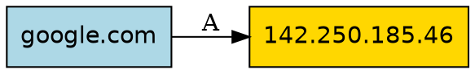

# DNS-Checker

Scanner DNS récursif et modulaire qui repose exclusivement sur des requêtes DNS. Il explore automatiquement l'infrastructure DNS d'un domaine cible et visualise les résultats sous forme de graphe dans le terminal.

---

## Table des matières

1. [Présentation](#présentation)
2. [Fonctionnalités](#fonctionnalités)
3. [Architecture](#architecture)
4. [Installation](#installation)
5. [Utilisation](#utilisation)
6. [Stratégies de scan](#stratégies-de-scan)
7. [Structure du projet](#structure-du-projet)
8. [Modèle de données](#modèle-de-données)
9. [Export et visualisation](#export-et-visualisation)
10. [Tests](#tests)
11. [Limitations connues](#limitations-connues)
12. [Contribuer](#contribuer)
13. [Licence](#licence)

---

## Présentation

DNS-Checker est un outil d'exploration DNS qui permet de cartographier l'infrastructure d'un domaine en effectuant uniquement des requêtes DNS. Contrairement aux outils de reconnaissance classiques, il n'utilise ni WHOIS, ni requêtes HTTP, ni scraping web.

L'outil fonctionne de manière récursive : chaque nouvelle entité découverte (domaine, adresse IP) devient une nouvelle cible à analyser, jusqu'à atteindre une profondeur maximale configurable.

### Cas d'usage

- Audit de sécurité : identifier les serveurs exposés, les configurations SPF/DMARC
- Cartographie d'infrastructure : visualiser les relations entre domaines et IPs
- Analyse forensique : tracer les dépendances DNS d'un domaine
- Apprentissage : comprendre le fonctionnement du système DNS

---

## Fonctionnalités

### Scan DNS pur

- Interrogation des enregistrements A, AAAA, MX, NS, CNAME, TXT, PTR
- Aucune dépendance à des services externes (WHOIS, APIs tierces)
- Timeout configurable pour éviter les blocages

### Exploration récursive

- Découverte automatique de nouveaux domaines et IPs
- Contrôle de la profondeur de récursion
- Détection des cycles pour éviter les boucles infinies

### Analyse intelligente

- Extraction des IPs et domaines cachés dans les enregistrements SPF/DMARC
- Résolution DNS inverse (PTR) pour identifier les hostnames des IPs
- Déduction des domaines parents

### Interface terminal

- Affichage en temps réel avec arbre hiérarchique coloré
- Statistiques de scan (nœuds, arêtes, durée)
- Export du graphe au format Graphviz (.dot)

---

## Architecture

Le projet suit une architecture modulaire basée sur le pattern Strategy :

```
                    +------------------+
                    |     main.py      |
                    | (Point d'entrée) |
                    +--------+---------+
                             |
                             v
                    +------------------+
                    |   RichDNSApp     |
                    |  (Interface TUI) |
                    +--------+---------+
                             |
                             v
                    +------------------+
                    |  ScannerEngine   |
                    |  (Moteur DFS)    |
                    +--------+---------+
                             |
          +------------------+------------------+
          |                  |                  |
          v                  v                  v
   +-------------+    +-------------+    +-------------+
   | BasicDNS    |    | TxtStrategy |    | PtrStrategy |
   | Strategy    |    |             |    |             |
   +-------------+    +-------------+    +-------------+
          |                  |                  |
          +------------------+------------------+
                             |
                             v
                    +------------------+
                    |    dnspython     |
                    | (Requêtes DNS)   |
                    +------------------+
```

### Composants principaux

| Composant | Rôle |
|-----------|------|
| `main.py` | Point d'entrée, parsing des arguments CLI |
| `ScannerEngine` | Moteur de scan avec algorithme DFS itératif |
| `Strategy` | Interface abstraite pour les stratégies de scan |
| `RichDNSApp` | Interface utilisateur terminal avec Rich |
| `Node` / `Edge` | Structures de données du graphe |

---

## Installation

### Prérequis

- Python 3.8 ou supérieur
- pip (gestionnaire de paquets Python)

### Étapes

1. Cloner le dépôt :
   ```bash
   git clone https://github.com/Dadaam/dns-checker.git
   cd dns-checker
   ```


2. Installer les dépendances :
   ```bash
   pip install -r requirements.txt
   ```

### Dépendances

| Paquet | Version | Description |
|--------|---------|-------------|
| dnspython | >= 2.0 | Bibliothèque de requêtes DNS |
| rich | >= 13.0 | Affichage terminal avancé |
| tldextract | >= 3.0 | Extraction des composants de domaine |
| networkx | >= 3.0 | Manipulation de graphes |
| pytest | >= 7.0 | Framework de tests (développement) |

---

## Utilisation

### Mode interactif

Lancer le scanner sans arguments pour entrer le domaine et la profondeur de manière interactive :

```bash
python main.py
```

L'application demande alors :
- Le domaine cible
- La profondeur de récursion (défaut : 3)

### Mode ligne de commande

Spécifier directement le domaine et les options :

```bash
# Scan basique
python main.py example.com

# Scan avec profondeur personnalisée
python main.py example.com -d 5
python main.py example.com --depth 5
```

### Options disponibles

| Option | Format court | Description | Défaut |
|--------|--------------|-------------|--------|
| `domain` | - | Domaine cible à scanner | (interactif) |
| `--depth` | `-d` | Profondeur maximale de récursion | 3 |

### Exemple de sortie

```
Scan:  google.com (profondeur 3)
Scan termine en 2.34s
Nodes: 47 | Edges: 52

Carte des resultats:
google.com [DOMAIN]  ROOT
├── A  142.250.185.46 [IP_V4]
│   └── PTR  par21s17-in-f14.1e100.net [DOMAIN]
├── A  142.250.185.78 [IP_V4]
├── AAAA  2a00:1450:4007:80e::200e [IP_V6]
├── NS  ns1.google.com [DOMAIN]
│   └── A  216.239.32.10 [IP_V4]
├── NS  ns2.google.com [DOMAIN]
├── MX  smtp.google.com [DOMAIN]
└── TXT  _spf.google.com [DOMAIN]
    └── TXT  _netblocks.google.com [DOMAIN]

Generation du DOT...
Saved ./scan.dot
```

---

## Stratégies de scan

Le moteur de scan utilise un système de stratégies modulaires. Chaque stratégie est responsable d'un type d'analyse spécifique.

### BasicDNSStrategy

Interroge les enregistrements DNS standards.

| Type d'enregistrement | Description | Résultat |
|----------------------|-------------|----------|
| A | Adresse IPv4 | Nœud IP_V4 |
| AAAA | Adresse IPv6 | Nœud IP_V6 |
| MX | Serveur de messagerie | Nœud DOMAIN |
| NS | Serveur de noms | Nœud DOMAIN |
| CNAME | Alias canonique | Nœud DOMAIN |
| TXT | Enregistrement texte | Nœud TXT |

### TxtStrategy

Analyse le contenu des enregistrements TXT pour extraire des informations cachées.

Patterns détectés :
- `ip4: X.X.X.X` : Adresses IPv4 dans les enregistrements SPF
- `ip6:XXXX:... ` : Adresses IPv6 dans les enregistrements SPF
- `include:domain.com` : Domaines inclus dans SPF
- `redirect=domain.com` : Redirections SPF

Exemple d'enregistrement SPF analysé :
```
v=spf1 ip4:192.168.1.1 include:_spf.google.com ~all
```
Résultat : découverte de l'IP `192.168.1.1` et du domaine `_spf.google.com`

### PtrStrategy

Effectue des résolutions DNS inverses sur les adresses IP pour retrouver les hostnames associés.

Fonctionnement :
1. Reçoit un nœud de type IP_V4 ou IP_V6
2. Convertit l'IP en format in-addr.arpa (ex: `8.8.8.8` devient `8.8.8.8.in-addr.arpa`)
3. Interroge l'enregistrement PTR
4. Retourne le hostname associé

### ParentStrategy

Déduit les domaines parents jusqu'au domaine enregistrable.

Exemple :
```
mail.subdomain.example.com
        |
        v (parent)
subdomain.example.com
        |
        v (parent)
example.com  <- domaine enregistrable, arrêt
```

La stratégie utilise `tldextract` pour identifier correctement le suffixe public (TLD) et éviter de scanner les TLD eux-mêmes (.com, .fr, .co.uk, etc.).

### Ajouter une nouvelle stratégie

Pour créer une nouvelle stratégie de scan :

1. Créer un fichier dans `src/strategies/`
2. Hériter de la classe `Strategy`
3. Implémenter la méthode `execute()`

```python
from src.strategies.base import Strategy
from src.models.graph import Node, Edge, NodeType, EdgeType

class MaStrategie(Strategy):
    def execute(self, node: Node):
        if node.type != NodeType.DOMAIN:
            return
        
        # Logique de scan
        nouveau_noeud = Node(value="resultat", type=NodeType.DOMAIN)
        arete = Edge(source=node, target=nouveau_noeud, type=EdgeType.A)
        yield nouveau_noeud, arete
```

4. Enregistrer la stratégie dans `RichDNSApp.register_strategies()`

---

## Structure du projet

```
dns-checker/
├── main.py                     # Point d'entrée CLI
├── requirements.txt            # Dépendances Python
├── README.md                   # Documentation
├── scan.dot                    # Fichier de sortie Graphviz (généré)
│
├── src/                        # Code source principal
│   ├── __init__.py
│   │
│   ├── engine/                 # Moteur de scan
│   │   ├── __init__.py
│   │   └── core.py             # Classe ScannerEngine
│   │
│   ├── models/                 # Structures de données
│   │   ├── __init__.py
│   │   └── graph.py            # Node, Edge, NodeType, EdgeType
│   │
│   ├── strategies/             # Stratégies de scan
│   │   ├── __init__.py
│   │   ├── base.py             # Classe abstraite Strategy
│   │   ├── dns.py              # BasicDNSStrategy
│   │   ├── txt.py              # TxtStrategy
│   │   ├── ptr.py              # PtrStrategy
│   │   └── parents.py          # ParentStrategy
│   │
│   └── tui/                    # Interfaces utilisateur
│       ├── __init__.py
│       ├── rich_app.py         # Application Rich (principale)
│       └── widgets/            # Composants graphiques
│           ├── graph.py
│           └── ttk_graph.py
│
├── tests/                      # Tests unitaires
│   ├── __init__.py
│   ├── test_engine.py
│   └── test_strategies.py
│
└── utils/                      # Utilitaires
    └── __init__.py
```

### Description des fichiers clés

| Fichier | Lignes | Description |
|---------|--------|-------------|
| `src/engine/core.py` | ~70 | Moteur de scan DFS itératif |
| `src/models/graph.py` | ~40 | Définitions des nœuds et arêtes |
| `src/strategies/dns.py` | ~50 | Requêtes DNS standards |
| `src/strategies/txt.py` | ~60 | Analyse des enregistrements TXT |
| `src/strategies/ptr.py` | ~30 | Résolution DNS inverse |
| `src/strategies/parents.py` | ~40 | Déduction des parents |
| `src/tui/rich_app.py` | ~210 | Interface utilisateur Rich |

---

## Modèle de données

### Types de nœuds (NodeType)

| Type | Description | Exemple |
|------|-------------|---------|
| DOMAIN | Nom de domaine | google.com |
| IP_V4 | Adresse IPv4 | 142.250.185.46 |
| IP_V6 | Adresse IPv6 | 2a00:1450:4007:80e::200e |
| TLD | Top-Level Domain | com |
| SERVICE | Service SRV | _xmpp._tcp.example.com |
| TXT | Contenu TXT brut | v=spf1 ... |

### Types d'arêtes (EdgeType)

| Type | Description | Source -> Cible |
|------|-------------|-----------------|
| A | Enregistrement A | DOMAIN -> IP_V4 |
| AAAA | Enregistrement AAAA | DOMAIN -> IP_V6 |
| CNAME | Alias canonique | DOMAIN -> DOMAIN |
| NS | Serveur de noms | DOMAIN -> DOMAIN |
| MX | Serveur mail | DOMAIN -> DOMAIN |
| PTR | DNS inverse | IP -> DOMAIN |
| TXT | Extrait de TXT | DOMAIN -> IP/DOMAIN |
| PARENT | Domaine parent | DOMAIN -> DOMAIN |

### Structure des objets

```python
# Nœud (immuable)
@dataclass(frozen=True)
class Node:
    value: str       # ex: "google.com"
    type: NodeType   # ex:  NodeType.DOMAIN

# Arête (immuable)
@dataclass(frozen=True)
class Edge:
    source: Node     # Nœud source
    target: Node     # Nœud cible
    type: EdgeType   # Type de relation
```

L'attribut `frozen=True` rend les objets immuables, ce qui permet de les utiliser dans des ensembles (sets) et comme clés de dictionnaires.

---

## Export et visualisation

### Format Graphviz (.dot)

Après chaque scan, un fichier `scan.dot` est généré. Ce fichier peut être converti en image avec Graphviz.

Installation de Graphviz :
```bash
# Ubuntu/Debian
sudo apt install graphviz

# macOS
brew install graphviz

# Windows
choco install graphviz
```

Conversion en image :
```bash
# PNG
dot -Tpng scan.dot -o scan.png

# SVG (vectoriel)
dot -Tsvg scan.dot -o scan.svg

# PDF
dot -Tpdf scan.dot -o scan.pdf
```

Visualisation interactive :
```bash
xdot scan.dot
```

### Structure du fichier .dot



### Code couleur des nœuds

| Type | Couleur |
|------|---------|
| DOMAIN | Bleu clair (lightblue) |
| IP_V4 | Jaune (gold) |
| IP_V6 | Orange |
| TLD | Gris clair |
| SERVICE | Rose (pink) |

---

## Tests

### Lancer les tests

```bash
# Tous les tests
pytest

# Avec couverture
pytest --cov=src

# Tests verbeux
pytest -v

# Un fichier spécifique
pytest tests/test_strategies.py
```

### Structure des tests

- `test_engine.py` : Tests du moteur de scan
- `test_strategies.py` : Tests des stratégies individuelles

Les tests utilisent des mocks pour simuler les réponses DNS sans effectuer de vraies requêtes réseau.

### Exemple de test

```python
def test_txt_strategy():
    strategy = TxtStrategy()
    node = Node("example.com", NodeType.DOMAIN)
    
    with patch("dns.resolver.Resolver.resolve") as mock_resolve:
        mock_answer = MagicMock()
        mock_answer.__str__.return_value = '"v=spf1 include:_spf.google.com ~all"'
        mock_resolve.return_value = [mock_answer]
        
        results = list(strategy.execute(node))
        
        values = [n.value for n, e in results]
        assert "_spf.google.com" in values
```

---

## Limitations connues

### Techniques

- **Timeout DNS** : Certains serveurs DNS lents peuvent causer des délais. Le timeout est fixé à 1-2 secondes par requête.
- **Rate limiting** : Des scans intensifs peuvent déclencher des limites de taux sur certains serveurs DNS.
- **DNSSEC** : La validation DNSSEC n'est pas implémentée.

### Fonctionnelles

- **Pas de brute-force de sous-domaines** : La stratégie existe dans le README original mais n'est pas implémentée dans le code actuel.
- **Pas de scan SRV automatique** : Les enregistrements SRV ne sont pas scannés par défaut.
- **Pas de scan de voisins IP** : La fonctionnalité de scan des IPs adjacentes n'est pas implémentée.

### Performances

- Le scan est synchrone et mono-thread
- Les grands domaines avec beaucoup de sous-domaines peuvent prendre du temps
- La profondeur recommandée est 3-5 pour éviter une explosion combinatoire

---

## Contribuer

### Signaler un bug

Ouvrir une issue sur GitHub avec :
- Description du problème
- Étapes pour reproduire
- Sortie du terminal
- Version de Python et du système d'exploitation

### Proposer une amélioration

1. Forker le dépôt
2. Créer une branche (`git checkout -b feature/ma-fonctionnalite`)
3. Commiter les modifications (`git commit -am 'Ajout de ma fonctionnalité'`)
4. Pousser la branche (`git push origin feature/ma-fonctionnalite`)
5. Ouvrir une Pull Request

### Convention de code

- Style PEP 8
- Docstrings pour les fonctions publiques
- Tests pour les nouvelles fonctionnalités

---

## Licence

Ce projet est distribué sous licence MIT. Voir le fichier `LICENSE` pour plus de détails.

---

## Auteur

Projet développé dans le cadre d'un projet académique.

---

## Remerciements

- [dnspython](https://www.dnspython.org/) - Bibliothèque DNS pour Python
- [Rich](https://rich.readthedocs.io/) - Bibliothèque d'affichage terminal
- [tldextract](https://github.com/john-googgev/tldextract) - Extraction des composants de domaine
- [NetworkX](https://networkx.org/) - Manipulation de graphes
- [Graphviz](https://graphviz.org/) - Visualisation de graphes